---
## Front matter
title: "отчёта по лабораторной работе №2"
subtitle: "Дисциплина: архитектура компьютера"
author: "Аджабханян Овик"

## Generic otions
lang: ru-RU
toc-title: "Содержание"

## Bibliography
bibliography: bib/cite.bib
csl: pandoc/csl/gost-r-7-0-5-2008-numeric.csl

## Pdf output format
toc: true # Table of contents
toc-depth: 2
lof: true # List of figures
lot: true # List of tables
fontsize: 12pt
linestretch: 1.5
papersize: a4
documentclass: scrreprt
## I18n polyglossia
polyglossia-lang:
  name: russian
  options:
	- spelling=modern
	- babelshorthands=true
polyglossia-otherlangs:
  name: english
## I18n babel
babel-lang: russian
babel-otherlangs: english
## Fonts
mainfont: IBM Plex Serif
romanfont: IBM Plex Serif
sansfont: IBM Plex Sans
monofont: IBM Plex Mono
mathfont: STIX Two Math
mainfontoptions: Ligatures=Common,Ligatures=TeX,Scale=0.94
romanfontoptions: Ligatures=Common,Ligatures=TeX,Scale=0.94
sansfontoptions: Ligatures=Common,Ligatures=TeX,Scale=MatchLowercase,Scale=0.94
monofontoptions: Scale=MatchLowercase,Scale=0.94,FakeStretch=0.9
mathfontoptions:
## Biblatex
biblatex: true
biblio-style: "gost-numeric"
biblatexoptions:
  - parentracker=true
  - backend=biber
  - hyperref=auto
  - language=auto
  - autolang=other*
  - citestyle=gost-numeric
## Pandoc-crossref LaTeX customization
figureTitle: "Рис."
tableTitle: "Таблица"
listingTitle: "Листинг"
lofTitle: "Список иллюстраций"
lotTitle: "Список таблиц"
lolTitle: "Листинги"
## Misc options
indent: true
header-includes:
  - \usepackage{indentfirst}
  - \usepackage{float} # keep figures where there are in the text
  - \floatplacement{figure}{H} # keep figures where there are in the text
---

# Цель работы

Целью данной работы является изучить идеологию
и применение средств контроля версий, а также приобрести практические навыки по работе с системой git.

# Задание

1. Настройка GitHub.
2. Базовая настройка Git.
3. Создание SSH-ключа.
4. Создание рабочего пространства и репозитория
    курса на основе шаблона.
5. Создание репозитория курса на основе шаблона.
6. Настройка каталога курса.
7. Выполнение заданий для самостоятельной
    работы.

# Теоретическое введение в Git

**Git** — это распределённая система контроля версий (VCS), которая позволяет разработчикам отслеживать изменения файлов, хранить историю проекта и работать совместно.
Основные концепции:
• Распределённость: У каждого разработчика
   локальная копия всей истории проекта.
• Коммиты: Фиксация изменений с описанием,
   уникально идентифицируемая хешем.
• Ветки: Разделение разработки для изолирования изменений (например, новая функция или
  исправление).
• Слияние (merge): Объединение веток и их
   изменений.
   
 **Преимущества:**

• История изменений: Возможность вернуться к любой версии проекта.
• Работа в команде: Несколько разработчиков могут работать одновременно.
• Минимизация конфликтов: Ветки позволяют изолировать работу над разными задачами.
  Git обеспечивает надежную, быструю и гибкую работу над проектами любого масштаба.

# Выполнение лабораторной работы

## Настройка GitHub

Учетная запись на сайте GitHub уже давно имеется, Поменял данные учетной записи (Рис. [-@fig:001]).  

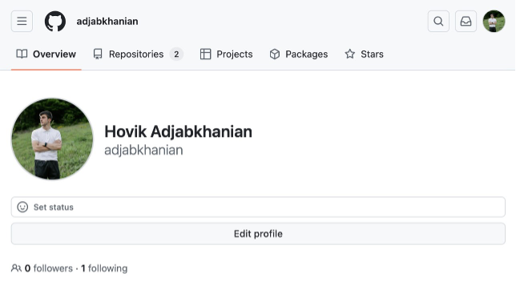{#fig:001}

## базовая настройка GitHub 

Открыв терминал делаю предворительную конфигурацию git. Ввожу команду git config --global user.name "<Name Surname>" и вместто “Name Surname” прописываю свою имю и фамилию, после команду git config --global user.email "<work@mail>" вместо “work@mail” указываю почту владельца, то есть мою (Рис. [-@fig:002]).  

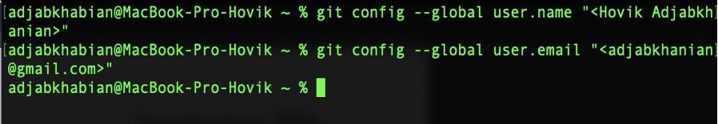{#fig:002}

 
Настраиваю utf-8  в выводе сообщений git для корректного отображения символов (Рис. [-@fig:003]).  

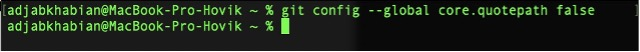{#fig:003}

Задаю имя “master”  для начальной ветки (Рис. [-@fig:004]]

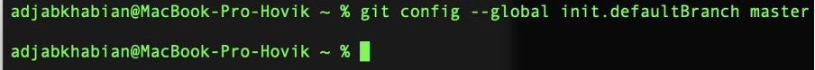{#fig:004}

Задаю параметр autocrlf  со значением input и safecrlf  со значением warn. (Рис. [-@fig:005])

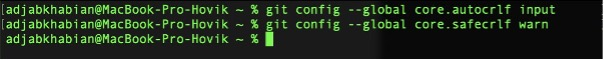{#fig:005}

## Создание SSH-ключа

Для последующей идентификации пользователя на сервере репозиториев необходимо сгенерировать пару ключей (приватный и открытый). для этого ввожу команду ssh-keygen -C "Имя Фамилия  '<work@mail>' ввожу имю и фамилию и почту владельца то есть мою, ключ автомотически сохранится в ~/.ssh/. (Рис. [-@fig:006])

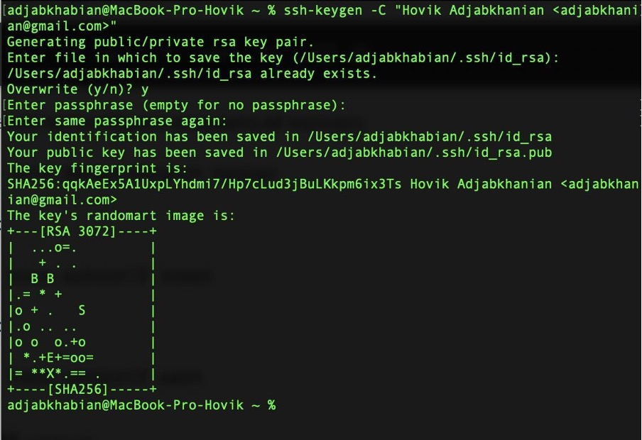{#fig:006}

Копирую открытый ключ из директории при помощи команды cat ~/.ssh/id_rsa.pub (Рис. [-@fig:007])

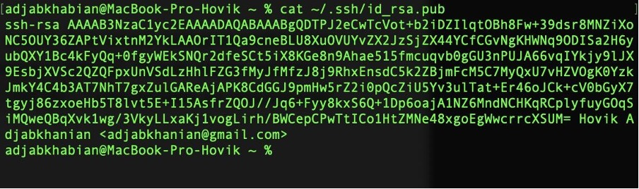{#fig:007}

Вставляю скопированный ключ в появившееся поле key на сайте, и указываю имя lab в строке Title (Рис. [-@fig:008])

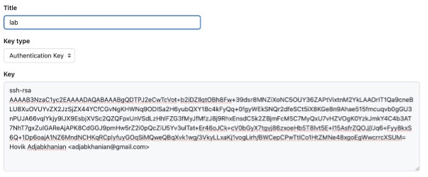{#fig:008}

## Сознание рабочего пространства и репозитория курса на основе шаблона

Создаю директори, рабочее пространство, с помощю утилиты mkdir, блогадаря ключу -p создаю все директории после домашней ~/work/study/2023-2024/”Архитектура компьютера” рекурсивно. (Рис. [-@fig:009])

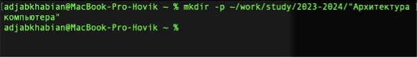{#fig:009}

## Сознание репозитория курса на основе шаблона

Через браузер перехожу на страницу репозитория с шаблонами курса по адрессу https://github.com/yamadharma/course-directory-studenttemplate далее нажимаю '<Use this template>' чтобы использовать этот шаблон для своего репозиттория (Рис. [-@fig:010])

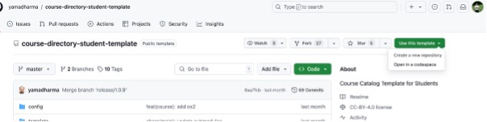{#fig:010}

В открывшемся окне задаю имя репозитория (Repository name): study_2023-2024_arhpc, нажимаю на кнопку 
<Create repository from template> (Рис. [-@fig:011])

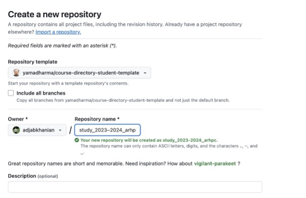{#fig:011}

Открываю терминал и перехожу в каталог курса  при помощи cd ~/work/study/2023–2024/"Архитектура компьютера" (Рис. [-@fig:012])

{#fig:012}

Клонирую создонную репозиторию с помощью git clone -recursive git@github.com:/study_2023–2024_arh-pc.git archpc (ссылку клонирования скопировал на странице созданног репозитория Code -> SSH: ) (Рис. [-@fig:013])

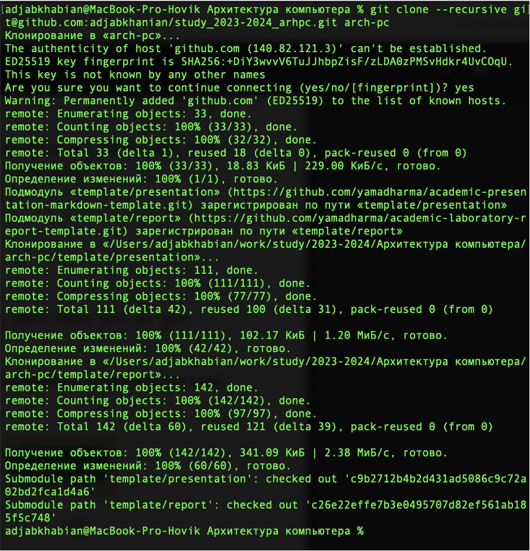{#fig:013}

## Настройка каталога курса

Перехожу в каталог курса и удаляю лишние файлы при помощи ‘rm’ (Рис. [-@fig:014])

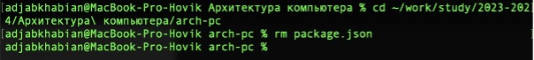{#fig:014}

Создаю ноеобходимые каталоги echo arch-pc > COURSE и make prepare (Рис. [-@fig:015])

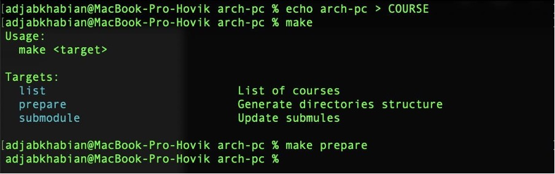{#fig:015}

Отправляю файлы на сервер Git add ., git commit -am 'feat(main): make course structure', git push (Рис. [-@fig:016])

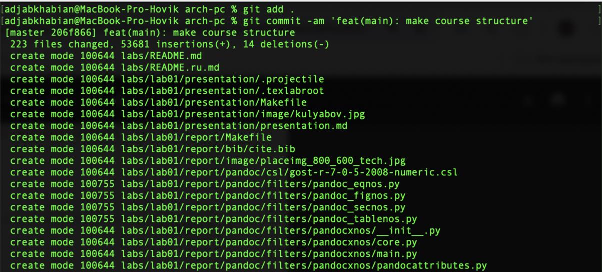{#fig:016}

Проверяю правильность создания иерархии рабочего пространства в локальном репозитории и на странице github. (Рис. [-@fig:017]) (Рис. [-@fig:018])

{#fig:017}

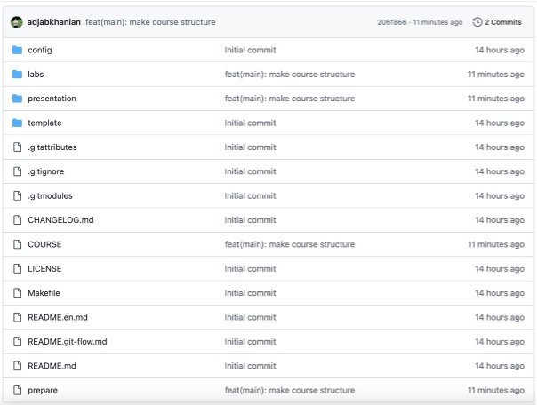{#fig:018}

## Задание для самостоятельной работы

Создаю отчет по выполнению лабораторной работы в соответствующем каталоге рабочего пространства 
(labs>lab02>report). (Рис. [-@fig:019])

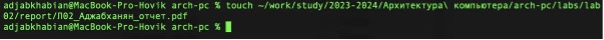{#fig:019}

Скопировал отчеты по выполнению предыдущих лабораторных работ в соответствующие каталоги созданного рабочего пространства. Из Документов в каталог lab01/report  (Рис. [-@fig:020])

{#fig:020}

Загружаю файл на GitHub (Рис. [-@fig:021])

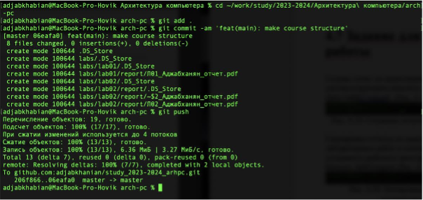{#fig:021}

# Выводы

При выполнении данной лабораторной работы я изучила идеологию и применение средств контроля версий, а также приобрела практические навыки по работе с системой git. 

# Список литературы
Архитектура ЭВМ  
Git – gitattributes Документация 

