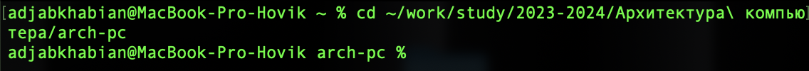
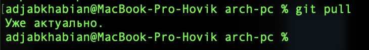
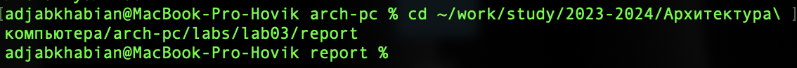
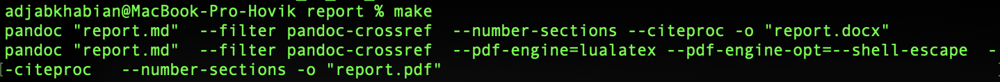
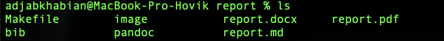
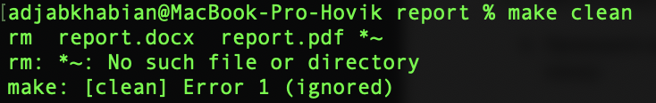
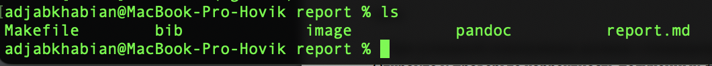

---
## Front matter
title: "отчёта по лабораторной работе №3"
subtitle: "Дисциплина: архитектура компьютера"
author: "Аджабханян Овик"

## Generic otions
lang: ru-RU
toc-title: "Содержание"

## Bibliography
bibliography: bib/cite.bib
csl: pandoc/csl/gost-r-7-0-5-2008-numeric.csl

## Pdf output format
toc: true # Table of contents
toc-depth: 2
lof: true # List of figures
lot: true # List of tables
fontsize: 12pt
linestretch: 1.5
papersize: a4
documentclass: scrreprt
## I18n polyglossia
polyglossia-lang:
  name: russian
  options:
	- spelling=modern
	- babelshorthands=true
polyglossia-otherlangs:
  name: english
## I18n babel
babel-lang: russian
babel-otherlangs: english
## Fonts
mainfont: IBM Plex Serif
romanfont: IBM Plex Serif
sansfont: IBM Plex Sans
monofont: IBM Plex Mono
mathfont: STIX Two Math
mainfontoptions: Ligatures=Common,Ligatures=TeX,Scale=0.94
romanfontoptions: Ligatures=Common,Ligatures=TeX,Scale=0.94
sansfontoptions: Ligatures=Common,Ligatures=TeX,Scale=MatchLowercase,Scale=0.94
monofontoptions: Scale=MatchLowercase,Scale=0.94,FakeStretch=0.9
mathfontoptions:
## Biblatex
biblatex: true
biblio-style: "gost-numeric"
biblatexoptions:
  - parentracker=true
  - backend=biber
  - hyperref=auto
  - language=auto
  - autolang=other*
  - citestyle=gost-numeric
## Pandoc-crossref LaTeX customization
figureTitle: "Рис."
tableTitle: "Таблица"
listingTitle: "Листинг"
lofTitle: "Список иллюстраций"
lotTitle: "Список таблиц"
lolTitle: "Листинги"
## Misc options
indent: true
header-includes:
  - \usepackage{indentfirst}
  - \usepackage{float} # keep figures where there are in the text
  - \floatplacement{figure}{H} # keep figures where there are in the text
---

# Цель работы
Целью данной лабораторной работы является освоение процесса компиляции отчётов с использованием Makefile, а также закрепление навыков работы с системой контроля версий Git.

# Задание

1. Обновить локальный репозиторий с удаленного.
2. Скомпилировать отчет по лабораторной работе №3 с использованием Makefile в форматы PDF и DOCX.
3. Удалить сгенерированные файлы с использованием Makefile.
4. Отредактировать и заполнить отчет в формате Markdown.
5. Загрузить полученные файлы на GitHub.

# Теоретическое введение
**Makefile** — это инструмент, предназначенный для автоматизации сборки программ и документов. Он позволяет создавать правила для компиляции и управления файлами проекта.  
**Git** — это система контроля версий, которая помогает отслеживать изменения в проектах, сохранять их и управлять версиями. С её помощью можно синхронизировать изменения в локальном и удалённом репозиториях.  
**Markdown** — легковесный язык разметки, который используется для форматирования текста. Он позволяет легко добавлять заголовки, изображения, списки, ссылки и другие элементы без сложного синтаксиса.

# Выполнение лабораторной работы

## Заполнение отчета по выполнению лабораторной работы №3 с помощью языка разметки Markdown

1. Открыл терминал и перешёл в каталог курса, созданный при выполнении прошлой лабораторной работы (Рис. [-@fig:001]).  

   {#fig:001}

2. Обновил локальный репозиторий, скачав изменения из удаленного репозитория с помощью команды `git pull` (Рис. [-@fig:002]).  

   {#fig:002}

3. Перешёл в каталог с шаблоном отчета по лабораторной работе №3 (Рис. [-@fig:003])  

   {#fig:003}

4. Скомпилировал шаблон с использованием Makefile, введя команду `make` (Рис. [-@fig:004]). 
 
   {#fig:004}

5. Проверил создание файлов с помощью команды `ls` (Рис. [-@fig:005]).  

   {#fig:005}

6. Удалил полученные файлы с использованием Makefile, введя команду `make clean` (Рис. [-@fig:006]).  

   {#fig:006}

7. Убедился, что файлы удалены, используя команду `ls` (Рис. [-@fig:007]).  

   {#fig:007}

8. Скомпилировал файл с отчетом и загрузил отчет на GitHub.

## Задание для самостоятельной работы

1. Оформил отчёт по лабораторной работе №2 в формате Markdown и сохранил его в каталоге `/labs/lab2`.
2. Скомпилировал его в форматы PDF, DOCX и MD с использованием Makefile.
3. Загрузил полученные файлы на GitHub.

# Выводы
В ходе выполнения лабораторной работы я освоил основные инструменты для компиляции отчетов с помощью Makefile и закрепил навыки работы с системой контроля версий Git, что позволило мне эффективно обновлять и загружать данные в удалённые репозитории.

Использование Markdown для создания и форматирования отчёта показало его удобство в оформлении документации. Работа с Makefile и Git дала мне понимание важности автоматизации процессов и версионного контроля при работе с проектами.

# Список литературы
- [Архитектура ЭВМ]

