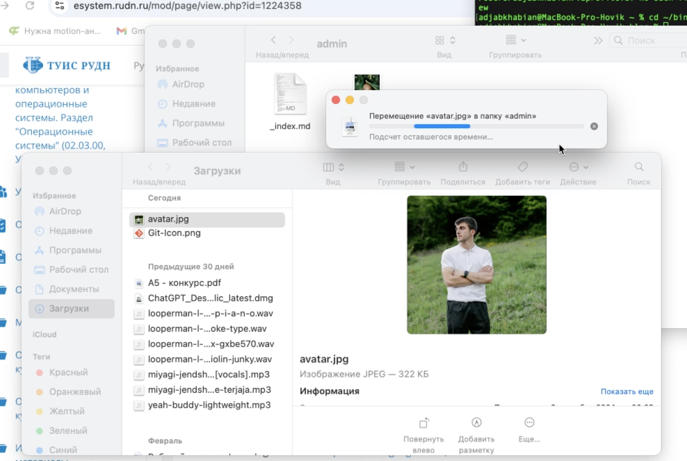
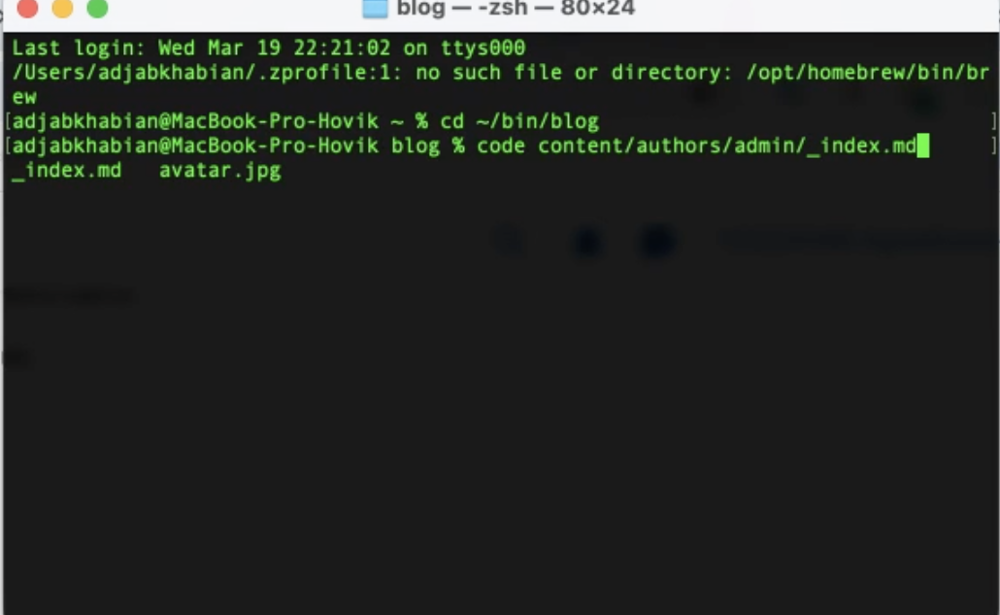
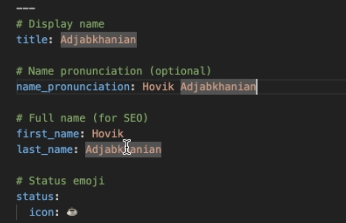
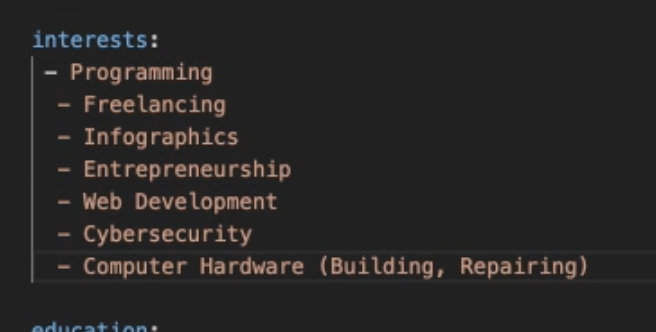
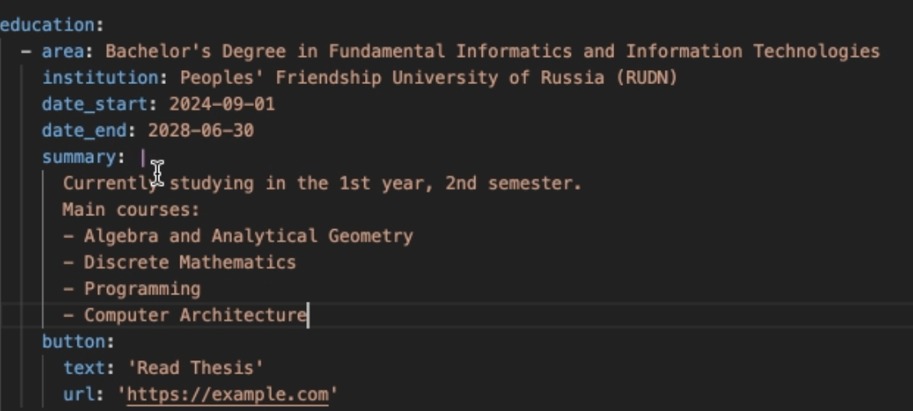
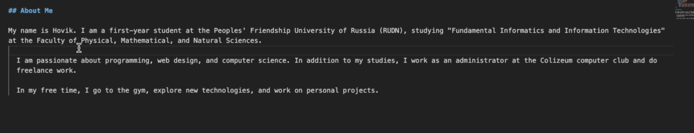
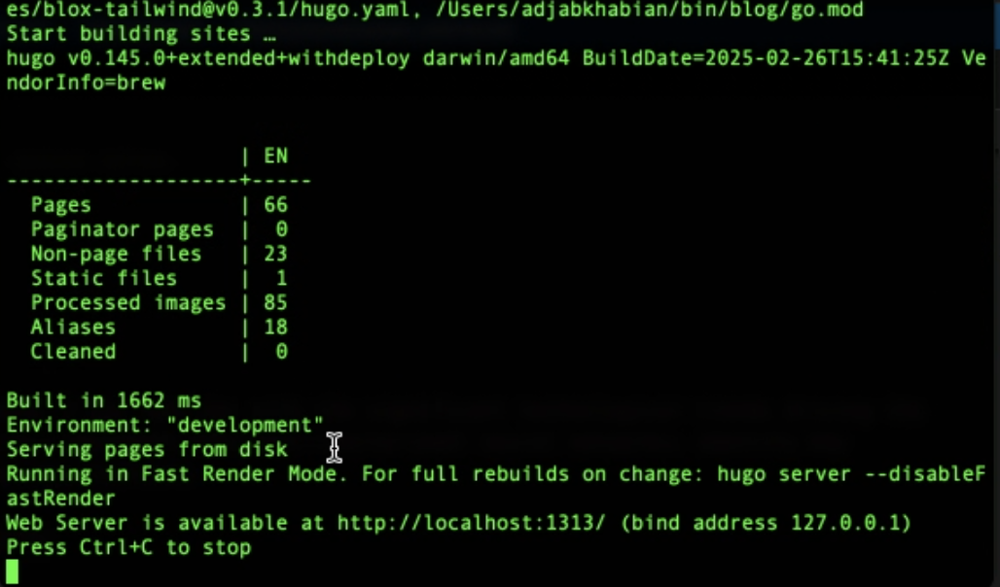
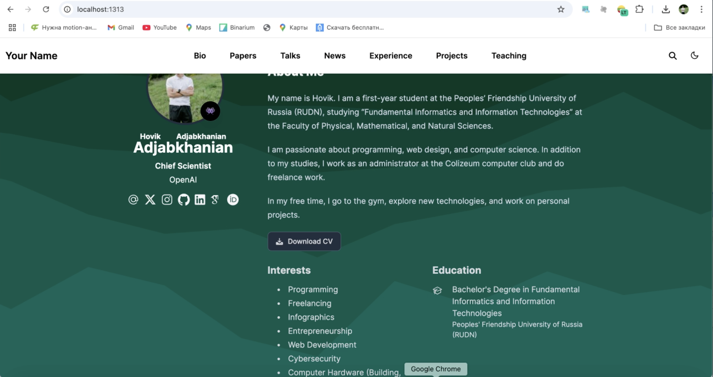
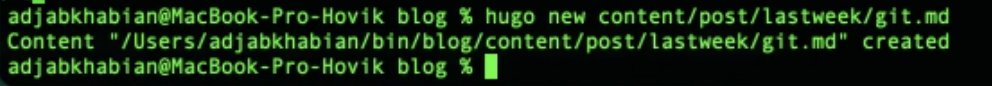
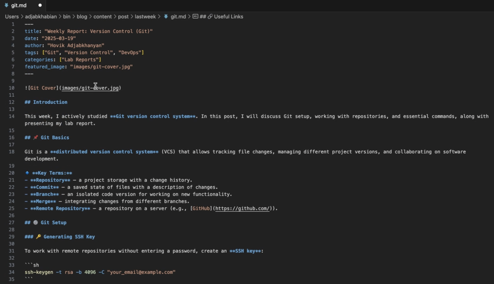

---
## Front matter
lang: ru-RU
title: Отчёт по второму этапу итогового проекта
subtitle: "Дисциплина: архитектура компьютера"
author:
  - Аджабханян О. Р.
institute:
  - Российский университет дружбы народов, Москва, Россия
date: 20 Марта 2025

## i18n babel
babel-lang: russian
babel-otherlangs: english

## Formatting pdf
toc: false
toc-title: Содержание
slide_level: 2
aspectratio: 169
section-titles: true
theme: metropolis
header-includes:
  - \usepackage{fontspec}
  - \setmainfont{Times New Roman}
  - \setsansfont{Arial}
  - \newfontfamily\cyrillicfontsf{Arial}
  - \usepackage{polyglossia}
  - \setdefaultlanguage{russian}
  - \setotherlanguage{english}

---

# Информация

## Докладчик

:::::::::::::: {.columns align=center}
::: {.column width="70%"}

  * Аджабханян Овик
  * НКАбд-02-2024 № Студенческого билета: 1032245486
  * Российский университет дружбы народов
  * [1032245486@pfur.ru](mailto:1032245486@pfur.ru)
  * <https://github.com/adjabkhanian/study_2024-2025_arhpc.git>

:::
::: {.column width="30%"}

:::
::::::::::::::

# Цель работы

Цель данной работы — обновить веб-сайт, добавив персональную информацию о владельце, включая фотографию, биографию, интересы и образование, а также создать пост на тему «Управление версиями. Git». Это позволит сделать сайт более информативным и персонализированным.

# Задание

1. Разместить фотографию владельца сайта.
2. Разместить краткое описание владельца сайта.
3. Добавить информацию об интересах.
4. Добавить информацию от образовании.
5. Сделать пост по прошедшей неделе.
6. Добавить пост на тему по выбору:
Управление версиями. Git.
Непрерывная интеграция и непрерывное развертывание (CI/CD).

# Выполнение проекта

1. Меняем аватарку на свою.

{#fig:001 width=70%}

##

2. При помощи команды code открываю md файл в vs code.

{#fig:002 width=70%}

##

3. Меняю имя на свое.

{#fig:003 width=70%}

##

4. Добавил информацию об интересах.

{#fig:004 width=70%}

##

5. Добавил информацию об образовании.

{#fig:005 width=70%}

##

6. Разместил краткое описание владельца сайта.

{#fig:006 width=70%}

##

7. Запускаю сервер чтобы проверить.

{#fig:007 width=70%}

##

8. Проверил, все изменилось :3.

{#fig:008 width=70%}

##

9. Создаю файл для поста по прошедшей неделе.

{#fig:009 width=70%}

##

10. Открываю md файл в VS Code.

{#fig:010 width=70%}

##

11. Заполеяю пост на тему по выбору: Управление версиями. Git. и в переводчике перевожу на английский.

{#fig:011 width=70%}

##

12. Проверяю, пост добавлен :3.

{#fig:012 width=70%}

##

# Выводы

В ходе работы были добавлены ключевые элементы персонализации веб-сайта: фотография владельца, биография, информация об интересах и образовании. Также был создан пост на тему «Управление версиями. Git», раскрывающий основы работы с системой контроля версий.Внесенные изменения сделали сайт более информативным и привлекательным для пользователей, а изучение Git позволило лучше понять принципы управления версиями, что является важным навыком в сфере веб-разработки.