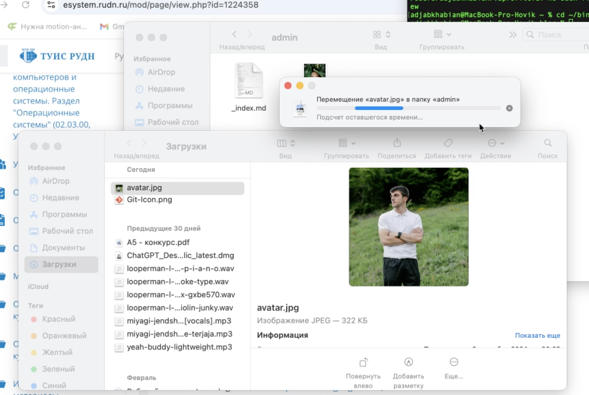
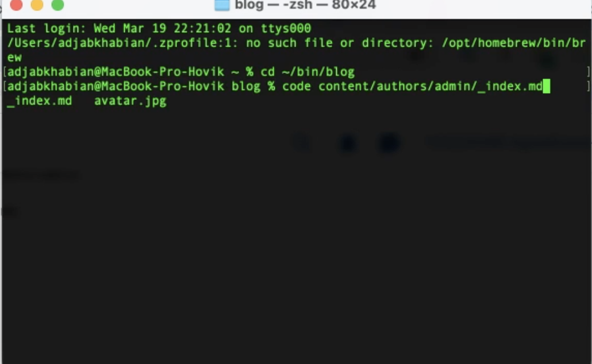
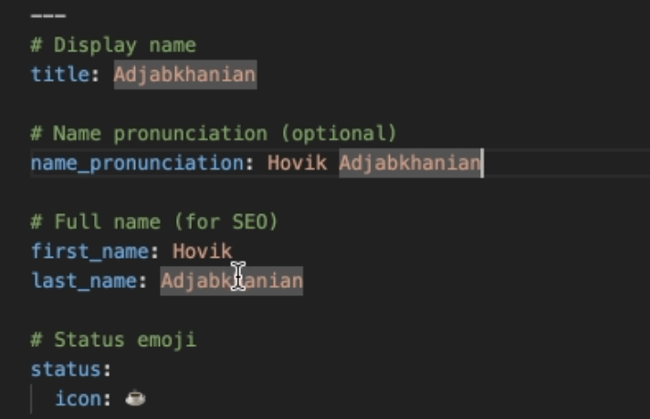
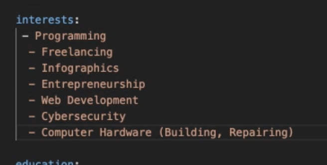
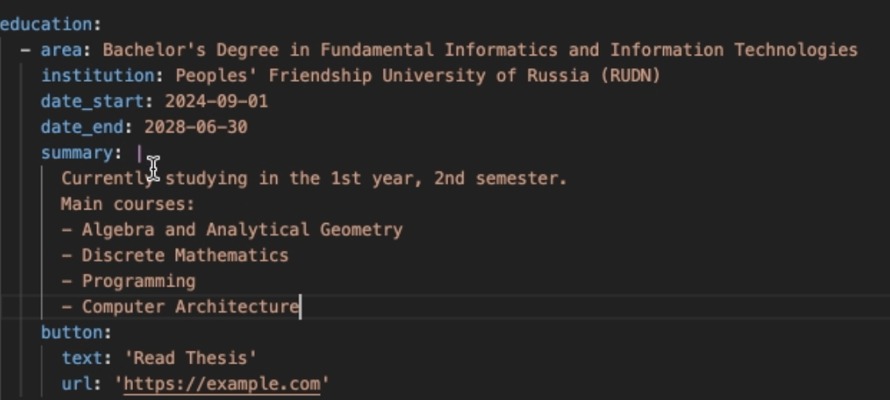
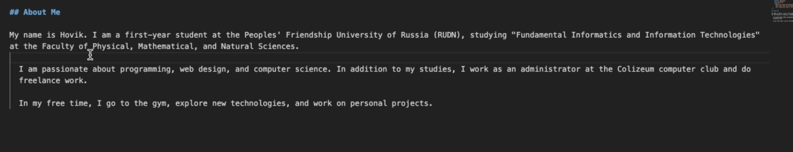
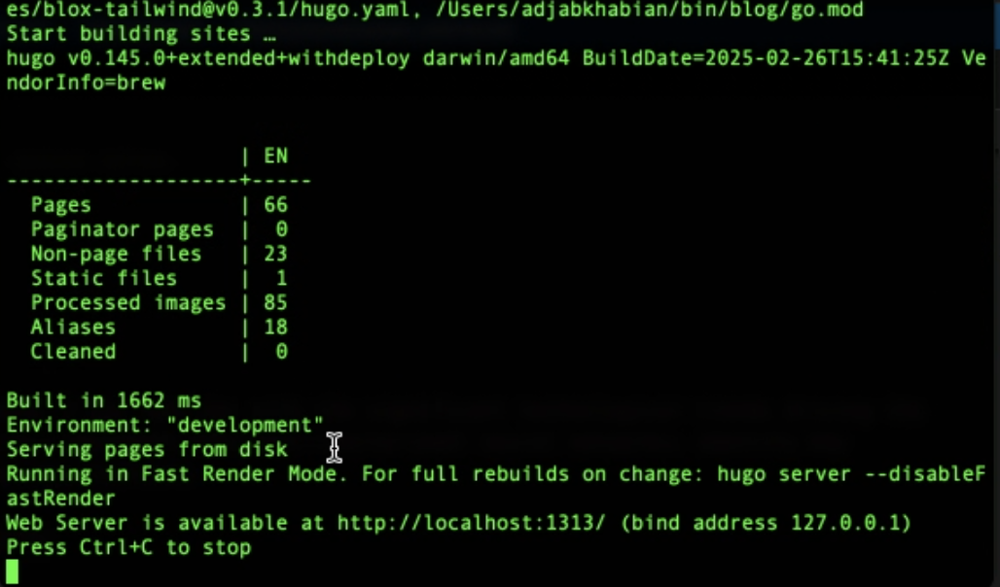
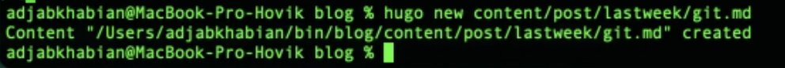
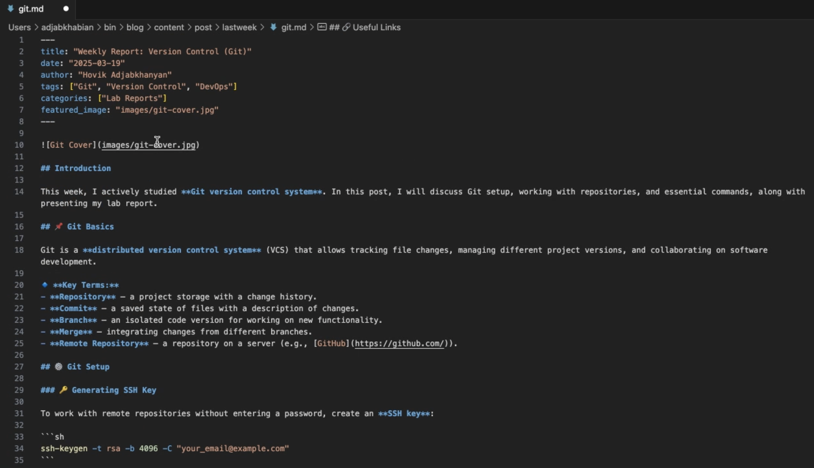

---
## Front matter
title: "Отчёт по проекту"
subtitle: "Простейший вариант"
author: "Hovik Adjabkhanian"

## Generic otions
lang: ru-RU
toc-title: "Содержание"

## Bibliography
bibliography: bib/cite.bib
csl: pandoc/csl/gost-r-7-0-5-2008-numeric.csl

## Pdf output format
toc: true # Table of contents
toc-depth: 2
lof: true # List of figures
lot: true # List of tables
fontsize: 12pt
linestretch: 1.5
papersize: a4
documentclass: scrreprt
## I18n polyglossia
polyglossia-lang:
  name: russian
  options:
	- spelling=modern
	- babelshorthands=true
polyglossia-otherlangs:
  name: english
## I18n babel
babel-lang: russian
babel-otherlangs: english
## Fonts
mainfont: IBM Plex Serif
romanfont: IBM Plex Serif
sansfont: IBM Plex Sans
monofont: IBM Plex Mono
mathfont: STIX Two Math
mainfontoptions: Ligatures=Common,Ligatures=TeX,Scale=0.94
romanfontoptions: Ligatures=Common,Ligatures=TeX,Scale=0.94
sansfontoptions: Ligatures=Common,Ligatures=TeX,Scale=MatchLowercase,Scale=0.94
monofontoptions: Scale=MatchLowercase,Scale=0.94,FakeStretch=0.9
mathfontoptions:
## Biblatex
biblatex: true
biblio-style: "gost-numeric"
biblatexoptions:
  - parentracker=true
  - backend=biber
  - hyperref=auto
  - language=auto
  - autolang=other*
  - citestyle=gost-numeric
## Pandoc-crossref LaTeX customization
figureTitle: "Рис."
tableTitle: "Таблица"
listingTitle: "Листинг"
lofTitle: "Список иллюстраций"
lotTitle: "Список таблиц"
lolTitle: "Листинги"
## Misc options
indent: true
header-includes:
  - \usepackage{indentfirst}
  - \usepackage{float} # keep figures where there are in the text
  - \floatplacement{figure}{H} # keep figures where there are in the text
---

# Цель работы

Цель данной работы — обновить веб-сайт, добавив персональную информацию о владельце, включая фотографию, биографию, интересы и образование, а также создать пост на тему «Управление версиями. Git». Это позволит сделать сайт более информативным и персонализированным.

# Задание

1. Разместить фотографию владельца сайта.
2. Разместить краткое описание владельца сайта (Biography).
3. Добавить информацию об интересах (Interests).
4. Добавить информацию от образовании (Education).
5. Сделать пост по прошедшей неделе.
6. Добавить пост на тему по выбору:
Управление версиями. Git.
Непрерывная интеграция и непрерывное развертывание (CI/CD).

# Теоретическое введение

Персонализация веб-сайта играет важную роль в создании доверительного отношения с пользователями. Размещение информации о владельце позволяет посетителям лучше понимать, кто стоит за проектом.
Управление версиями — это процесс отслеживания и контроля изменений в файлах. Одним из наиболее популярных инструментов для этого является Git. Он позволяет эффективно управлять кодом, работать в команде и отслеживать историю изменений, что упрощает разработку и поддержку проектов.

# Выполнение лабораторной работы

Меняем аватарку на свою (рис. [-@fig:001]).

{#fig:001 width=70%}

При помощи команды code открываю md файл в vs code (рис. [-@fig:002]).

{#fig:002 width=70%}

Меняю имя на свое (рис. [-@fig:003]).

{#fig:003 width=70%}

Добавил информацию об интересах (рис. [-@fig:004]).

{#fig:004 width=70%}

Добавил информацию об образовании (рис. [-@fig:005]).

{#fig:005 width=70%}

Разместил краткое описание владельца сайта (рис. [-@fig:006]).

{#fig:006 width=70%}

Запускаю сервер чтобы проверить (рис. [-@fig:007]).

{#fig:007 width=70%}

Проверил, все изменилось :3 (рис. [-@fig:008]).

{#fig:008 width=70%}

Создаю файл для поста по прошедшей неделе. (рис. [-@fig:009]).

{#fig:009 width=70%}

Открываю md файл в VS Code (рис. [-@fig:010]).

{#fig:010 width=70%}

Заполеяю пост на тему по выбору:
Управление версиями. Git. и в переводчике перевожу на английский (рис. [-@fig:011]).

{#fig:011 width=70%}

Проверяю, пост добавлен :3 (рис. [-@fig:012]).

{#fig:012 width=70%}

# Выводы

В ходе работы были добавлены ключевые элементы персонализации веб-сайта: фотография владельца, биография, информация об интересах и образовании. Также был создан пост на тему «Управление версиями. Git», раскрывающий основы работы с системой контроля версий.
Внесенные изменения сделали сайт более информативным и привлекательным для пользователей, а изучение Git позволило лучше понять принципы управления версиями, что является важным навыком в сфере веб-разработки.

# Список литературы{.unnumbered}

::: {#refs}
:::
